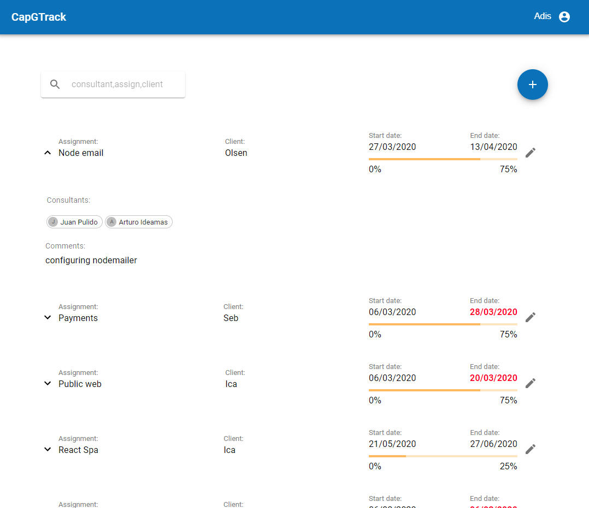
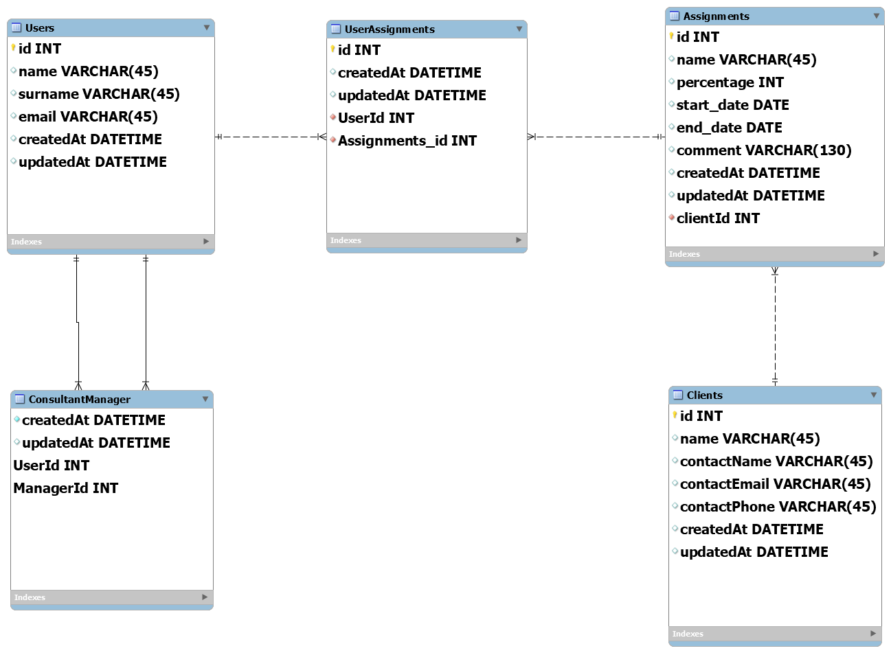

# CapGTrack

## Tracking consultant assignments.

### Features:
* Improve design from previous requirements. 
* Managers only have acess to the assignments where their consultants are assigned.
* End date colored in red when end date of assignment is less than 1 month ahead.
* Manager can create new assignments with the following information:
    - Project name.
    - Client. (consume options from Database)
    - Consultant. (consume options from Database)
    - Percentage.
    - Start date
    - End date
    - Comment.
* Manager can assigned more than one consultant to the same assignments.
* Consultants can be assigned in more than one assignment.
* Manager can update and delete assignments from the list.
* Responsive Design.
* Serching list assignments by consultants, client or name assignment.
* Form Validation (Back End) and showing errors in Front End.
* Api end-points secured.
* Authentication and authorization.

#### Data Base Model

### Technologies
* React with Hooks.
* Material UI.
* Express (Restful Api).
* SQLlite data base.
* Sequelize as ORM.
* Custom Authentication with Context, useReducer, useEffect and JWT.
* Deployment through Linux, PM2 and Ngnix

##### Improvements suggestions

* Moving local state of components to React Context or Redux to have the state centralized like I've done with the authentication part.
* Front End Form validation.
* Testing.
* BackEnd and/or FrontEnd caching.
* MySql or Postgressql
* CI/CD
* More Time  =)
* ...